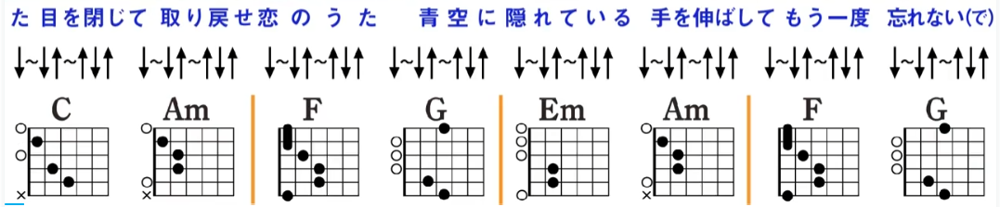
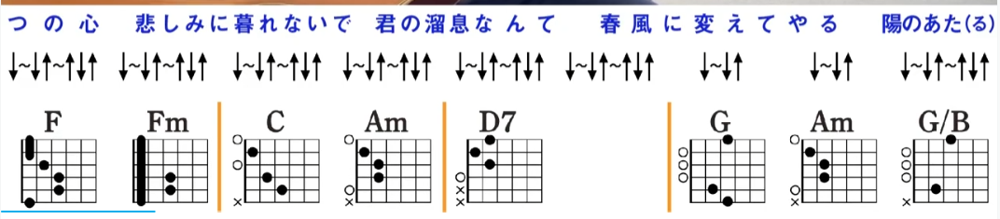
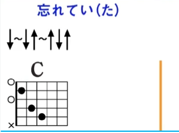
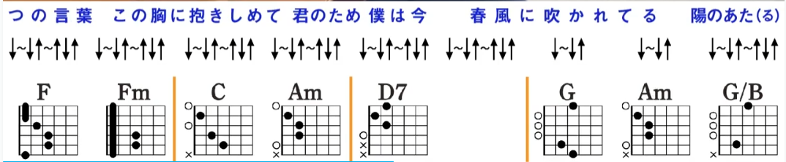
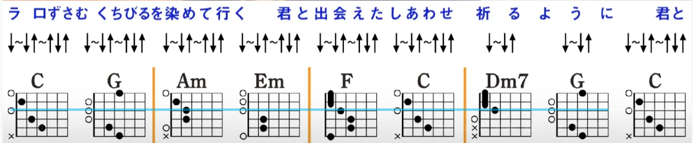
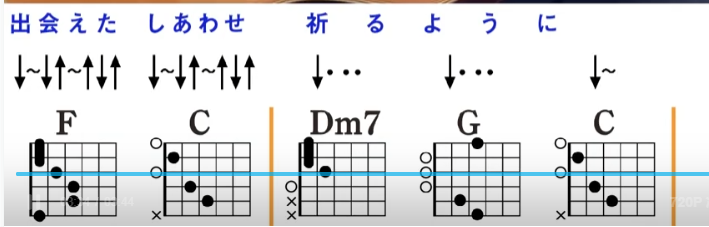

               C       Am           F      G
wasure te ita me o toji te     tori modose koi no uta
忘(わす)れていた目(め)を閉(と)じて　取(と)り戻(もど)せ恋(こい)のうた
Em      Am              F      G
aozora ni kakure te iru     te o nobashi te mou ichido
青空(あおぞら)に隠(かく)れている　手(て)を伸(の)ばしてもう一度(いちど)
C       Am           F      G
wasurenai de sugu soba ni    boku ga iru itsuno hi mo
忘(わす)れないですぐそばに　僕(ぼく)がいるいつの日(ひ)も
Em      Am           F  G   C
hoshizora o nagame te iru    hitori kiri no yoake mo
星空(ほしぞら)を眺(なが)めている　一(ひとり)人きりの夜(よ)明(あ)けも
Dm                          Am
tatte hitotsu no kokoro    kanashimi ni kure nai de
たった一(ひと)つの心(こころ)　悲(かな)しみに暮(く)れないで
Dm                    G
kimi no tame iki nante    haru kaze ni kae te yaru
君(きみ)のためいきなんて　春風(はるかぜ)に変(か)えてやる
C         G/B         Am     Em
hi no ataru saka michi o    jitensha de kake noboru
陽(ひ)のあたる坂道(さかみち)を　自転車(じてんしゃ)で駆(か)けのぼる
F        C          F      G
kimi to naku shita   omoide   nose te yuku yo
君(きみ)と失(な)くした思い出乗(での)せて行(ゆ)くよ
C         G/B         Am     Em
LALALALALA kuchi zusamu    kuchibiru o some te yuku
ラララララ　口(くち)ずさむ　くちびるを染(そ)めて行(ゆ)く
F        C          F      G     C
kimi to mitsuke ta   shiawase hana no youni
君(きみ)と見(み)つけたしあわせ花(ばな)のように
C       Am           F      G
wasure te ita mado akete    hashiri dase koi no uta
忘(わす)れていた窓開(まどあ)けて　走(はし)り出(だ)せ恋(こい)のうた
Em      Am              F      G
aozora ni taku shite iru     te o gaza shite mou ichido
青空(あおぞら)に託(たく)している　手(て)をかざしてもう一度(いちど)
C       Am           F      G
wasure nai yo sugu soba ni     kimi ga iru itsu no hi mo
忘(わす)れないよすぐそばに　君(きみ)がいるいつの日(ひ)も
Em      Am           F  G   C
hoshizora ni kaga yai te iru     namida yureru ashita mo
星空(ほしぞら)に輝(かがや)いてる　涙揺(なみだゆ)れる明日(あした)も
Dm                          Am
tatta hitotsu no kotoba   kono mune ni daki shimete
たった一(ひと)つの言葉(ことば)　この胸(むね)に抱(だ)きしめて
Dm                    G
kimi no tame boku wa ima    haru kaze ni fukare teru
君(きみ)のため僕(ぼく)は今(いま)　春風(はるかぜ)に吹(ふ)かれてる
C         G/B         Am     Em
hi no ataru saka michi o     jitensha de kake noboru
陽(ひ)のあたる坂道(さかみち)を　自転車(じてんしゃ)で駆(か)けのぼる
F               C                 F             G     
kimi to chikatta    yakusoku nose te yuku yo
君(きみ)と誓(ちか)った約(やく)束(そく)乗(の)せて行(ゆ)くよ
C                     G                           Am  Em
LALALALALA kuchi zusamu     kuchibiru o some te yuku
ラララララ　口(くち)ずさむ　くちびるを染(そ)めて行(ゆ)く
F         C                 F        G           C
kimi to de a e ta    shiawase inoru youni
君(きみ)と出(で)会(あ)えたしあわせ祈(いの)るように
C          G                 Am          Em
hi no ataru saka michi o     jitensha de kake noboru
陽のあたる坂道を 自転車で駆けのぼる
F       C            F         G
kimi to chikatta    yakusoku nose te yuku yo
君と誓った約束乗せて行くよ
C       G                 Am       Em
LALALALALA kuchizusamu     kuchibiru o some te yuku
ラララララ 口ずさむ くちびるを染めて行く
F            C                  F         G     C
kimi yo deaeta     shiawase inoru youni
君と出會えたしあわせ祈るように
F            C                  F         G     C
kimi yo deaeta     shiawase inoru youni
君(きみ)と出(で)会(あ)えたしあわせ祈(いの)るように
