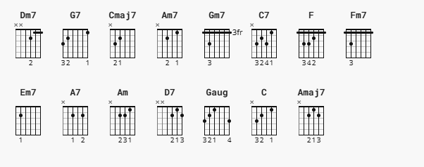

### https://tabs.ultimate-guitar.com/tab/laufey/i-wish-you-love-chords-3744272

Capo:no capo

[Verse 1]
             Dm7              G7
I wish you bluebirds in the spring
Cmaj7        Am7
To give your heart a song to sing
Dm7            G7
And then a kiss, but more than this
Cmaj7   Am7
I wish you love

         Dm7    G7
And in July a lemonade
Cmaj7         Am7
To cool you in some leafy glade
Dm7                   G7
I wish you health, and more than wealth
Cmaj7  Gm7
I wish you love

[Chorus]
C7          F            Fm7
My breaking heart and I agree
Em7           A7
That you and I could never be
Am            D7
So, with my best, my very best
Dm7  Gaug
I set you free-ee

[Verse 2]
Dm7              G7
I wish you shelter from the storm
Cmaj7             Am7
A cozy fire to keep you warm
Dm7                 G7
But most of all, when snowflakes fall
C
I wish you love

[Intrumental]
Am7 Dm7 G7 Cmaj7 Amaj7 A7 Dm7 G7 Cmaj7

Amaj7      Dm7 G7 Cmaj7 A7 Dm7 G7  C7
I wish you love,  love,    love,   love

[Chorus]
F            Fm7
My breaking heart and I agree
Em7           A7
That you and I could never be
Am            D7
So, with my best, my very best
Dm7  Gaug
I set you free-ee

[Verse 3]
Dm7              G7
I wish you shelter from the storm
Cmaj7             Am7
A cozy fire to keep you warm
Dm7                 G7
But most of all, when snowflakes fall
Em7                 A7
But most of all, when snowflakes fall
Dm7   G7    Cmaj7
I wish you love, love, love