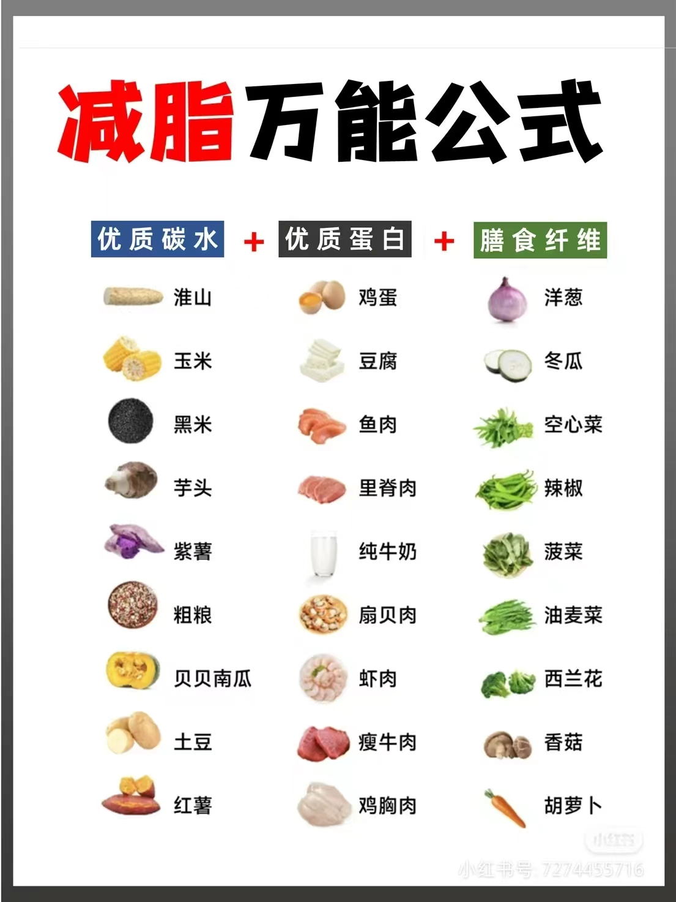
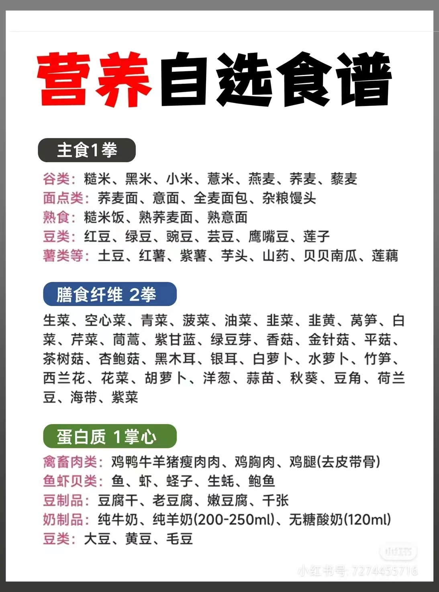
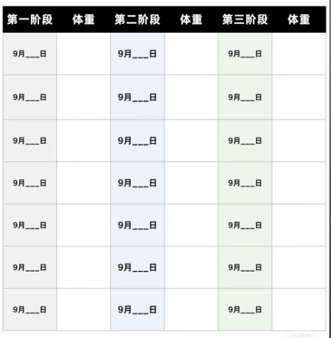

### 21天循环
> #### 第一至七天
>> 控油控糖
> 
>> 晚上10点后不吃任何东西
> 
>> 蔬菜-->蛋白质-->米饭
> 
>> 不能熬夜,必须保证>=8小时睡眠
> 
>> 饮水量 2500 ml
> 
>> 保证3次运动量

> #### 第八至十四天
>> 控制饭量
> 
>> 低热量食物替换高热量
> 
>> 午餐晚餐8分饱

> #### 第十五至二十一天
>> 饮水量 3000 ml
> 
>> 增加至5次运动量
> 
>> 补充优秀蛋白质
> 
>> 增加蔬菜摄入
> 
>> 晚餐后摄入苹果醋
### 细节
* 起床喝水 350 ml, 平时喝小口水,喝多次
* 早晨拉伸一下,睡觉前做一些拉伸运动
* 分清楚饿和馋,饿了吃低卡水果,馋了吃低卡零食
* 饭钱打量喝水 500 ml

